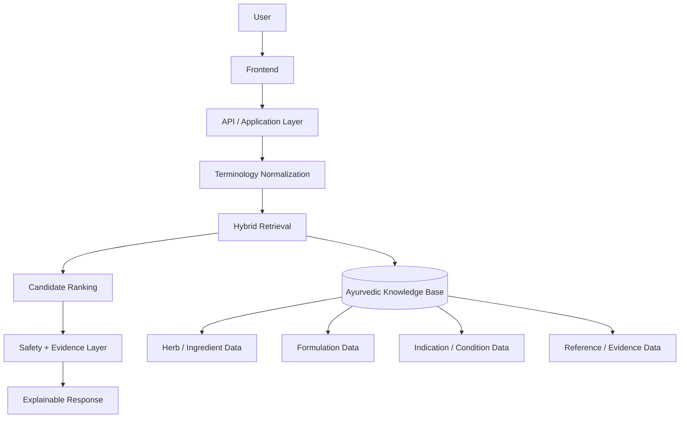

# System Architecture

## 1. Purpose

This document defines the high-level architecture of the Ayurvedic Formulation Intelligence Platform.

## 2. Logical architecture

## 3. Main components

### Frontend
Responsible for user input, search, results, formulation views, evidence displays, warnings, and explanations.

### API layer
Provides a controlled interface between the frontend and the application services.

### NLP / terminology layer
Normalizes user language, resolves synonyms and terminology variations, and prepares structured search concepts.

### Retrieval layer
Generates relevant candidates using structured and semantic retrieval.

### Ranking layer
Ranks candidates using relevance and evidence-related signals.

### Safety and evidence layer
Adds provenance, warnings, confidence/explanation information, and responsible-use messaging.

### Knowledge base
Stores structured relationships among ingredients, formulations, indications, properties, and references.

## 4. Design principles

- Explainability over opaque recommendations.
- Provenance should travel with retrieved knowledge.
- Safety information should be visible rather than hidden.
- Components should remain independently testable.
- Data, model artifacts, and application code should be separated.
