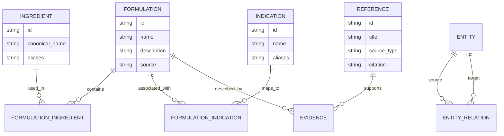

# Data Model

## Core entities

## Provenance

Each important knowledge record should retain:
- source
- source identifier
- citation or reference
- extraction/entry date
- data version
- validation status

## Design rule

The data model should make it possible to answer not only "what was returned?" but also "why was it returned and where did the supporting information come from?"
