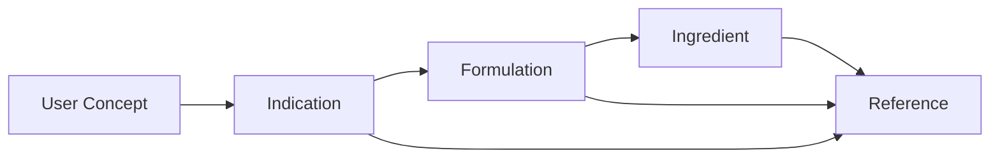

# Knowledge Graph

## Purpose

The knowledge graph represents relationships that are difficult to capture with a flat table.

## Relationship examples

- formulation contains ingredient
- formulation associated with concept
- concept has alias
- entity supported by reference
- entity related to another entity

## Benefits

A graph representation can support:
- explainable paths
- relationship-based retrieval
- connected exploration
- provenance tracing
- future graph analytics
