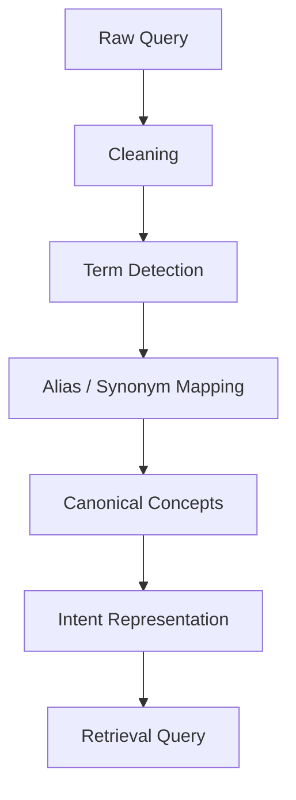

# NLP Pipeline

## Purpose

The NLP layer reduces the mismatch between how a user describes a need and how knowledge is represented in the database.

## Pipeline

## Components

### Cleaning
Normalize case, spacing, punctuation, and obvious input variations.

### Alias resolution
Map known alternate names to canonical terms.

### Concept extraction
Identify supported entities and concepts.

### Query representation
Produce a structured representation for retrieval.

## Fallback

If the system cannot confidently normalize a term, it should retain the original query and use semantic retrieval rather than inventing a canonical mapping.
