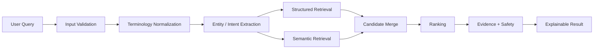

# System Flow

## End-to-end flow

## Stage descriptions

### 1. Input validation
Checks whether the request is present and usable.

### 2. Terminology normalization
Maps alternate terms to canonical concepts where possible.

### 3. Entity and intent extraction
Identifies useful concepts such as symptoms, ingredients, formulations, or other supported entities.

### 4. Hybrid retrieval
Combines structured filtering with semantic similarity.

### 5. Candidate merge
Removes duplicates and consolidates signals.

### 6. Ranking
Orders candidates according to the implemented scoring logic.

### 7. Evidence and safety
Attaches provenance, confidence/explanation information, and responsible-use notices.

### 8. Presentation
Shows the user why a result appeared rather than returning an unexplained label.
